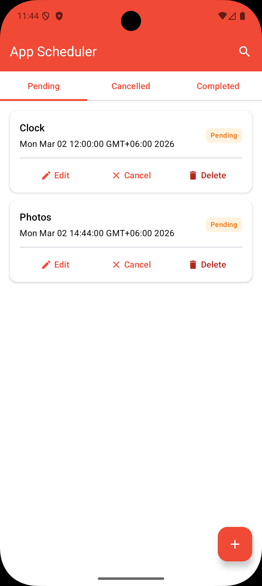
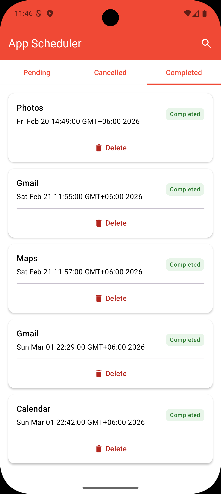
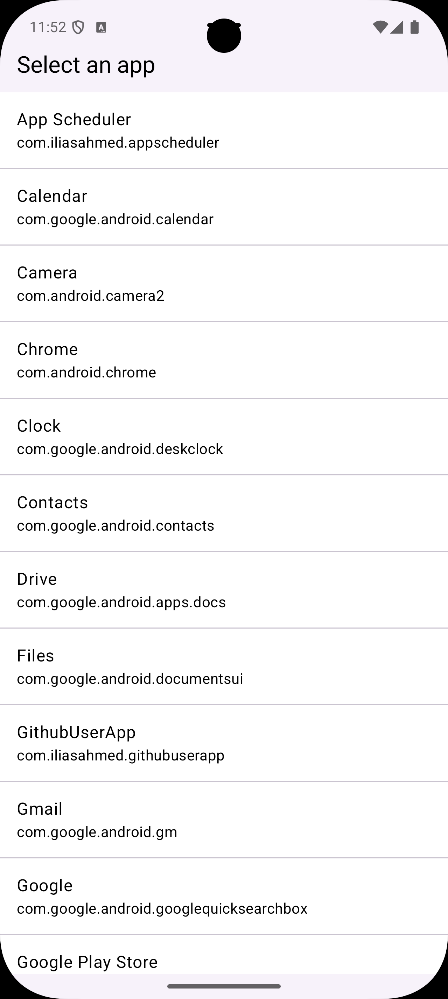
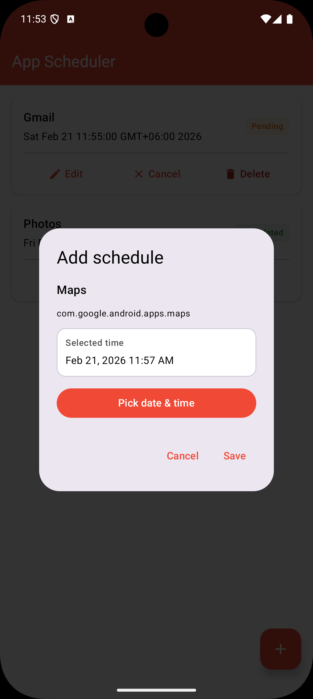

# App Scheduler (Android)

A simple Android app that lets users schedule installed apps to launch at a specific time.

## Features
- Schedule any installed app to open at a chosen time  
- Update or cancel existing schedules  
- Support multiple schedules (no time conflicts)  
- Track execution status (completed / failed)  
- View history of executed schedules  

## Screenshots

Here are some screenshots:

  
  
  
  

## Tech Stack
- Kotlin  
- MVVM + Clean Architecture  
- Room (local database)  
- WorkManager (background scheduling)  
- Hilt (dependency injection)  
- Coroutines + Flow  

## Architecture
The project follows MVVM with Clean Architecture:
- **Presentation**: UI + ViewModels  
- **Domain**: Use cases + models  
- **Data**: Repository, DAO, Room entities  

## Testing
- Unit tests for ViewModels, UseCases, Repository, and Worker  
- Coroutine test utilities and MockK  

## How to Run
1. Clone the project  
2. Open in Android Studio  
3. Build & Run on an emulator or real device  
